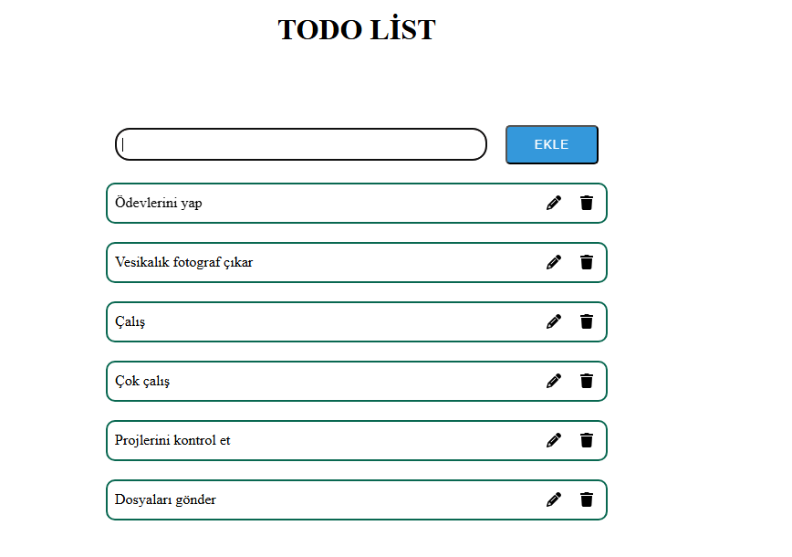

# React + Vite
<br/> <br/> 
## Todo App (React)

Bu proje, React kullanılarak geliştirilmiş basit bir Todo Uygulamasıdır.  
Kullanıcılar yeni görevler ekleyebilir, mevcut görevleri güncelleyebilir ve silebilir.
<br/> <br/> 
## 🚀 Özellikler

- ✅ Yeni todo ekleme  
- 📝 Mevcut todo güncelleme  
- 🗑️ Todo silme  
- 🎨 Basit ve şık arayüz (React Icons ile ikon desteği)
<br/> <br/> 
## 🛠️ Kullanılan Teknolojiler

- React  
- React Icons
<br/> <br/> 
## 📌 Kullanım

1. Input alanına yeni bir görev yaz → **EKLE** butonuna bas.  
2. Görevin yanındaki ✏️ ikonuna tıklayarak güncelle.  
3. Görevin yanındaki 🗑️ ikonuna tıklayarak sil.
<br/> <br/> 
## 📸 Ekran Görüntüsü


<br/> <br/> 
## 📂 Kurulum

1. Projeyi klonla:  
```bash
git clone https://github.com/Alptekin0/React.git

cd todoList
npm install
npm run dev

