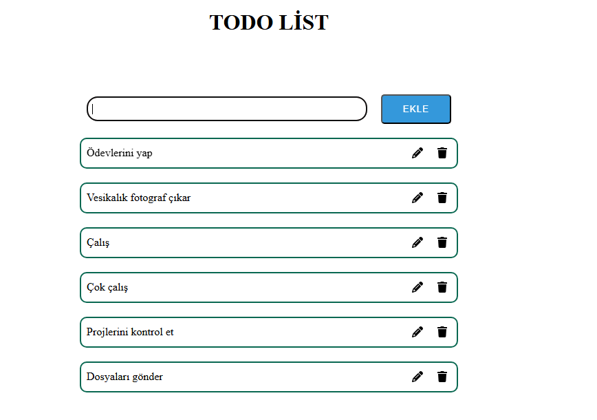

# React + Vite

## Todo App (React)

Bu proje, React kullanılarak geliştirilmiş basit bir Todo Uygulamasıdır.  
Kullanıcılar yeni görevler ekleyebilir, mevcut görevleri güncelleyebilir ve silebilir.  
  
## 🚀 Özellikler

- ✅ Yeni todo ekleme  
- 📝 Mevcut todo güncelleme  
- 🗑️ Todo silme  
- 🎨 Basit ve şık arayüz (React Icons ile ikon desteği)  
  
## 🛠️ Kullanılan Teknolojiler

- React  
- React Icons  
  
## 📌 Kullanım

Input alanına yeni bir görev yaz → EKLE butonuna bas.
Görevin yanındaki ✏️ ikonuna tıklayarak güncelle.
Görevin yanındaki 🗑️ ikonuna tıklayarak sil.

📸 Ekran Görüntüsü

## 📂 Kurulum

Projeyi kendi bilgisayarında çalıştırmak için:

# 1. Projeyi klonla
git clone https://github.com/kullaniciAdin/todo-app.git

# 2. Proje klasörüne gir
cd todoList

# 3. Gerekli paketleri yükle
npm install

# 4. Uygulamayı başlat
npm run dev
